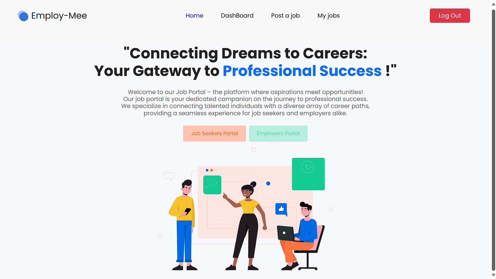

<div align="center">
    <h3 algin="center">Employ-Mee</h3>
  <p align="center">
    Empower your career journey with our job portal, where you can effortlessly create and post job opportunities to connect with top talent or find your next dream job.
    <br />
  </p>
</div>


<details>
  <summary><h3>Table of Contents</h3></summary>
  <ol>
    <li><a href="#about-the-project">About The Project</a> </li>
    <li><a href="#built-with">Built With</a></li>
    <li>
      <a href="#getting-started">Getting Started</a>
      <ul>
        <li><a href="#prerequisites">Prerequisites</a></li>
        <li><a href="#installation">Installation</a></li>
      </ul>
    </li>
    <li><a href="#usage">Usage</a></li>
    <li><a href="#contributing">Contributing</a></li>
    <li><a href="#contact">Contact</a></li>
    <li><a href="#acknowledgments">Acknowledgments</a></li>
    <li><a href="#deployment">Deployment</a></li>
  </ol>
</details>


## About The Project



Welcome to our job portal, a dynamic platform designed to facilitate seamless connections between job seekers and employers. Here’s a detailed overview of our website’s features and functionality:

### For Job Seekers
1. User Registration and Authentication:

    * Registration: Job seekers can quickly register for an account by providing their email address and creating a secure password.
    * Authentication: Secure login processes ensure the protection of user data.
2. Profile Management:

    * Profile Creation: Users can create comprehensive profiles that include their resumes, profile pictures, and detailed information about their skills, experience, and education.
    * Profile Updates: Users can easily update their profiles to reflect new skills, experiences, or job preferences.
3. Job Search and Filters:

    * Advanced Search: Users can search for job openings using a variety of filters such as job title, location, industry, salary range, and experience level.
    * Custom Filters: Filters help job seekers quickly find positions that match their qualifications and preferences.
4. Job Application:

    * Direct Applications: Users can apply for jobs directly through the portal by clicking on job listings and submitting their applications.
    * Saved Jobs and Alerts: Users can save jobs to apply for later and set up job alerts to be notified of new openings matching their criteria.
5. Application Tracking:

    * Dashboard: Users can track the status of their applications through a personalized dashboard, helping them stay organized and follow up as needed.

### For Employers
1. Employer Registration and Authentication:

    * Registration: Employers can create accounts by registering their companies and setting up secure login credentials.
    * Authentication: Only verified company managers can post job openings, ensuring the authenticity of job listings.
2. Company Profile Management:

    * Profile Creation: Employers can create detailed company profiles that include information about their business, culture, and values.
    * Profile Updates: Employers can update their profiles to attract potential candidates who are a good fit for their organization.
3. Job Posting Creation:

    * Easy Posting: Employers can create job postings by filling out a form with details such as job title, description, requirements, and benefits.
    * Customization: Employers can specify application deadlines and preferred application methods (e.g., through the portal or via email).
4. Job Posting Management:

    * Central Dashboard: Employers can manage all their job postings from a central dashboard, allowing them to edit, update, or remove listings as needed.
    * Analytics: Employers can track the number of views and applications for each job posting.

### Security and User Experience
* Secure Authentication: Both job seekers and employers benefit from robust authentication processes that protect their accounts and personal information.
* User-Friendly Interface: The website features an intuitive, user-friendly interface that ensures easy navigation for all users, whether searching for jobs or posting job openings.
* Responsive Design: The portal is designed to be fully responsive, providing a seamless experience across all devices, including desktops, tablets, and smartphones.
<br>
Use the `README.md` to get started.


## Built With

Here are list of major frameworks/libraries used to bootstrap project.

* [![Node][Node.js]][Node-url]
* [![React][React.js]][React-url]
* [![Bootstrap][Bootstrap.com]][Bootstrap-url]
* [![MongoDB][MongoDB-logo]][MongoDB-url]


## Getting Started

These instructions will get you a copy of the project up and running on your local machine for development and testing purposes.

### Prerequisites

Make sure you have the following software installed on your system:

- [Node.js](https://nodejs.org/) (v12.x or higher)
- [npm](https://www.npmjs.com/) (v6.x or higher) or [yarn](https://yarnpkg.com/)
- [MongoDB](https://www.mongodb.com/) (v4.x or higher)

### Installation

1. Clone the repository:

    ```sh
    git clone https://github.com/amaan-10/job-portal.git
    cd job-portal
    ```

2. Install server dependencies:

    ```sh
    cd server
    npm install
    ```

3. Install client dependencies:

    ```sh
    cd ../client
    npm install
    ```

4. Set up environment variables:

    Create a `.env` file in the `server` directory and add the following:

    ```env
    MONGO_URI=your_mongodb_connection_string
    PORT=8080
    ```
    
5. Enter your API in `config.js`
   ```js
   const API_KEY = 'ENTER YOUR API';
   ```

## Usage

1. Run MongoDB:

    Make sure your MongoDB server is running. You can start it with:

    ```sh
    mongod
    ```

2. Start the server:

    ```sh
    cd server
    npm start
    ```

    The server will start on `http://localhost:8080`.

3. Start the client:

    Open a new terminal window and run:

    ```sh
    cd client
    npm start
    ```

    The React app will start on `http://localhost:3000`.

4. To Start it together
   (*skip 3 & 4*):
   
   Open a new terminal window and run:

    ```sh
    cd server
    npm run dev
    ```
    > job-portal@1.0.0 dev
    > 
    > concurrently "npm run server" "npm run client"
   

6. Access the application:

    Open your web browser and go to `http://localhost:3000` to see the application in action.


## Contributing

Contributions are what make the open source community such an amazing place to learn, inspire, and create. Any contributions you make are **greatly appreciated**.

If you have a suggestion that would make this better, please fork the repo and create a pull request. You can also simply open an issue with the tag "enhancement".
Don't forget to give the project a star! Thanks again!

1. Fork the Project
2. Create your Feature Branch (`git checkout -b feature/AmazingFeature`)
3. Commit your Changes (`git commit -m 'Add some AmazingFeature'`)
4. Push to the Branch (`git push origin feature/AmazingFeature`)
5. Open a Pull Request


<!-- CONTACT -->
## Contact

Your Name - Amaan Shaikh amaanshaikh.gg@gmail.com

Project Link: [https://github.com/amaan-10/job-portal](https://github.com/amaan-10/job-portal)


## Acknowledgments

List of resources that are find helpful and would like to give credit to:

* [Figma template for Job Portal Website](https://www.figma.com/community/file/1192768903629888024/job-offer-platform)
* [npm.js libraries](https://www.npmjs.com/)
* [MongoDB Atlas and Clusters](https://www.mongodb.com/resources/products/fundamentals/clusters)
* [Google Fonts](https://fonts.google.com/)
* [Font Awesome](https://fontawesome.com)
* [React Icons](https://react-icons.github.io/react-icons/search)


[Node.js]: https://img.shields.io/badge/Node.js-339933?style=for-the-badge&logo=nodedotjs&logoColor=white
[Node-url]: https://nodejs.org/
[React.js]: https://img.shields.io/badge/React-20232A?style=for-the-badge&logo=react&logoColor=61DAFB
[React-url]: https://reactjs.org/
[Bootstrap.com]: https://img.shields.io/badge/Bootstrap-563D7C?style=for-the-badge&logo=bootstrap&logoColor=white
[Bootstrap-url]: https://getbootstrap.com
[MongoDB-logo]: https://img.shields.io/badge/MongoDB-4ea94b?style=for-the-badge&logo=mongodb&logoColor=white
[MongoDB-url]: https://www.mongodb.com/

## Deployment

### Employ-Mee : [Job-Portal Website Link](https://website-job-portal.netlify.app/)

**For User Login (*dummy*):**
<br>
**username :** test@test.com
<br>
**password :** 123456

*you can register for new account and then login*
